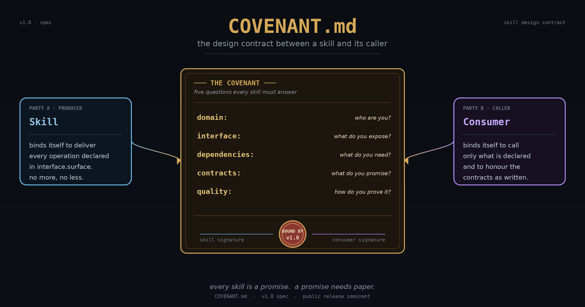

# COVENANT.md

**The design contract layer for AI agent skills.**

A portable, framework-agnostic file format for declaring *what a skill is*: its
domain, public interface, dependencies, typed contracts, and proof-of-correctness
fixtures, declared in YAML and markdown beside `SKILL.md` and validatable before a
single line of implementation is written.

[](https://www.npmjs.com/package/@covenant-md/core)
[](https://www.npmjs.com/package/@covenant-md/cli)
[](LICENSE)
[](LICENSE-spec)
[](https://github.com/SingularityAI-Dev/covenant-md/actions/workflows/ci.yml)
[](https://github.com/SingularityAI-Dev/covenant-md/actions)



Developed as the sibling of [LOGIC.md](https://github.com/SingularityAI-Dev/logic-md):
LOGIC.md describes the *flow* between steps; COVENANT.md describes the *contract*
of each skill those steps invoke. They are complementary, and never drawn the same
way.

---

## The problem

Skills are folders of prose. A caller, human or agent, has to read the entire
folder to learn what a skill exposes, what inputs it requires, what side effects
it has, and which outputs it actually produces. There is no enforceable boundary.

When the skill changes, callers find out at runtime. When two skills depend on each
other, nothing checks that the contract between them holds. When a model invokes a
skill outside its declared surface, nothing catches it.

This is not a documentation problem. It is a missing-contract problem.

**COVENANT.md fills that gap.** A covenant beside `SKILL.md` declares what the
skill is on five axes and lets a validator and a test runner enforce it.

---

## What it is

A markdown file with YAML frontmatter that sits beside `SKILL.md` in a skill
folder. The YAML is the machine-parseable contract; the markdown body is human
rationale. Two fields are required (`covenant_version`, `name`), the rest is
optional.

```yaml
---
covenant_version: "1.0"
name: docx-generation
version: 1.0.0
domain:
  purpose: Create and edit Microsoft Word documents
  scope: Reads and writes .docx files via a structured content object
interface:
  surface:
    - name: render
      accepts: [content, output_path]
      returns: [success]
contracts:
  inputs:
    content: { type: object, required: true }
    output_path: { type: string, required: true }
  outputs:
    success: { type: boolean }
quality:
  fixtures:
    - name: minimal-render
      operation: render
      input: { content: { title: "Hello" }, output_path: "/tmp/out.docx" }
      expect: { success: true }
---
```

A validator checks this against the spec; a contract-driven runner executes the
fixtures against a real or simulated skill runner. If the skill drifts from its
own covenant, the gate fails.

---

## The five questions

Every COVENANT.md answers five questions about a skill:

- **Domain: who are you?** The skill's identity and the problem space it owns.
- **Interface: what do you expose?** The operations callers may invoke, and
  nothing more. The boundary that stops internal complexity leaking outward.
- **Dependencies: what do you need?** The tools, sibling skills, and environment
  a correct invocation requires.
- **Contracts: what do you promise?** Typed inputs and outputs, plus invariants
  that hold for every invocation regardless of input.
- **Quality: how do you prove it?** Fixtures and gates that demonstrate the
  skill meets its contracts, runnable by a validator.

---

## How it relates to SKILL.md and LOGIC.md

**SKILL.md is the *how*; COVENANT.md is the *what*.** SKILL.md is procedural
knowledge: the steps, scripts, and tools an agent follows. COVENANT.md is the
design contract that sits above it, declaring the commitments the skill makes so
that callers can depend on a boundary rather than on the skill's internals.

**LOGIC.md is *flow*; COVENANT.md is *contract*.** LOGIC.md describes a
multi-step reasoning pipeline as a directed graph: a task-level structure of how
work flows from step to step. COVENANT.md describes a single skill as a bilateral
binding. A LOGIC.md step that invokes a skill can assert against that skill's
declared contract rather than guessing at its behaviour. A flow and a binding are
never drawn the same way.

---

## Skills as contracts

A skill that publishes a covenant is no longer a folder you have to read in full
to trust. It is a party to an agreement. State your domain, expose a narrow
interface, declare your dependencies, promise typed contracts, and prove them
with fixtures. That is the shift: **skills as contracts.** #SkillsAsContracts

---

## When to use COVENANT.md, and when not to

**Use COVENANT.md when:**

- A skill's interface is depended on by other skills, by agents, or by humans,
  and the boundary needs to be explicit and enforceable.
- You maintain a library of skills and want each one to declare its operations,
  typed inputs and outputs, and invariants.
- You want continuous validation of skills against a spec in CI.
- You are pairing with LOGIC.md and need each invoked skill to expose a contract
  the reasoning step can assert against.

**You probably do not need COVENANT.md when:**

- You have a one-off script with no callers and no interface to declare.
- The skill is still being prototyped and its surface is not yet known.
- You are optimising raw model output quality on a single LLM call. COVENANT.md
  is a contract layer, not a quality lever.

COVENANT.md does **not** make model outputs better. It makes the skill's surface
explicit, validatable, and testable, so callers depend on a declared boundary
rather than on reading the skill's internals.

---

## Packages

| Package | Description | Install |
| --- | --- | --- |
| [`@covenant-md/core`](https://www.npmjs.com/package/@covenant-md/core) | Parser, validator, contract-driven test runner, skill runner, lint, diff, graph. | `npm i @covenant-md/core` |
| [`@covenant-md/cli`](https://www.npmjs.com/package/@covenant-md/cli) | Six-command CLI (`validate`, `test`, `generate`, `lint`, `diff`, `graph`) with interactive scaffolding. | `npm i -g @covenant-md/cli` |

---

## Getting started

### As a CLI

```bash
npm install -g @covenant-md/cli

covenant validate examples/docx-generation/COVENANT.md
covenant test examples/docx-generation/
covenant generate                    # interactive blueprint
covenant lint examples/docx-generation/
covenant diff old/COVENANT.md new/COVENANT.md
covenant graph examples/
```

### As a library

```bash
npm install @covenant-md/core
```

```js
import {
  validateCovenant,
  CovenantTestRunner,
  createSkillRunner,
  lintCovenant,
  diffCovenants,
  graphSkills,
} from '@covenant-md/core';
```

### From source

```bash
git clone https://github.com/SingularityAI-Dev/covenant-md.git
cd covenant-md
npm ci
npm test                 # Jest across packages
npm run test:fixtures    # runs all four example skills through the CLI
```

---

## Examples tour

Four worked example skills live under `examples/`, each a complete COVENANT.md
plus SKILL.md you can validate and run:

- **markdown-to-html**: a single pure transform; the smallest useful covenant.
- **pdf-generation**: document creation with output contracts.
- **template-rendering**: typed inputs rendered against a template.
- **docx-generation**: create, read, and edit operations with invariants,
  roundtrip fixtures, and quality gates.

```bash
covenant test examples/docx-generation/
```

---

## Specification

The canonical specification is [`docs/COVENANT.md`](docs/COVENANT.md). It is the
source of truth when framework behaviour is ambiguous.

A canonical `spec/schema.json`, conformance fixtures, and three implementation
tiers (parser, runtime, full) are landing in v1.1 (see the roadmap below).

---

## Ecosystem

### Shipped (v1.0)

- [`@covenant-md/core`](https://www.npmjs.com/package/@covenant-md/core) on npm
- [`@covenant-md/cli`](https://www.npmjs.com/package/@covenant-md/cli) on npm
- [`@covenant-md/mcp`](https://www.npmjs.com/package/@covenant-md/mcp) on npm (MCP server, six tools over stdio)
- [`covenant-md`](https://pypi.org/project/covenant-md/) on PyPI (Python SDK, alpha; parser + validator with verdict parity against the shared `spec/fixtures/`)
- Canonical [`spec/schema.json`](spec/schema.json) plus 15 conformance fixtures and three conformance tiers; see [`docs/IMPLEMENTER-GUIDE.md`](docs/IMPLEMENTER-GUIDE.md)
- Reusable [GitHub Action](.github/actions/covenant-validate/action.yml) for CI
- Four worked example skills, validated end-to-end

### On the roadmap

- Claude Code plugin with `/covenant:` slash commands
- VSCode extension
- Evaluation benchmark harness

See [`ROADMAP.md`](ROADMAP.md) for the full arc.

---

## Status

- v1.0 shipped. `@covenant-md/core@1.0.0` and `@covenant-md/cli@1.0.0` published on npm.
- 56 Jest tests passing across two packages.
- Four example skills passing their fixtures end-to-end through the CLI.
- CI green on Node 20 and Node 22.

---

## Development

```bash
git clone https://github.com/SingularityAI-Dev/covenant-md.git
cd covenant-md
npm ci
npm test
npm run test:fixtures
npm run lint        # Biome
```

Stack: ESM JavaScript, Node 20+, npm workspaces, Jest under `--experimental-vm-modules`,
Biome for lint and formatting, `js-yaml`/`semver`/`yaml` for the parser.

---

## Contributing

See [CONTRIBUTING.md](CONTRIBUTING.md) for build and test instructions and the
project conventions (no em-dashes, British English, ESM only inside `packages/`).
Issues and pull requests are welcome.

Security disclosures: see [SECURITY.md](SECURITY.md).

---

## Licensing

- **Specification** (the COVENANT.md format and its prose): [CC-BY-4.0](LICENSE-spec).
- **Reference framework** (`packages/core` and `packages/cli`): [MIT](LICENSE).
- **The "COVENANT.md" name**: see [TRADEMARK.md](TRADEMARK.md), including the
  conditions for calling a tool "COVENANT.md compliant".

---

*Built by [Rainier Potgieter](https://github.com/SingleSourceStudios), Durban, South Africa. MIT licensed.*
